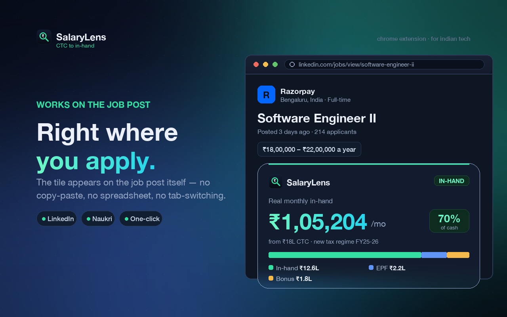
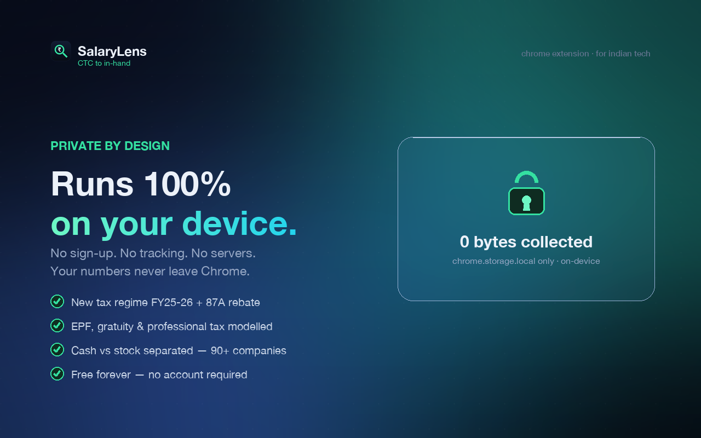

# SalaryLens — CTC → In-Hand Decoder

> That "₹18 LPA" offer isn't ₹1.5L a month. **SalaryLens** decodes any Indian **CTC** into
> your real **monthly in-hand** pay — right on the job post.

A Chrome (MV3) extension for Indian tech folks. It reads the salary on **LinkedIn** and
**Naukri** job pages and overlays what actually lands in your bank — accounting for EPF,
income tax (New Regime FY 2025-26 + 87A rebate), gratuity, professional tax, bonus and
stock/RSU. No salary listed? It estimates one from role, seniority and 90+ top employers.

## Highlights
- 💸 **Real in-hand, not headline CTC** — EPF, tax, gratuity, PT and bonus all modelled.
- 🧭 **Works on the job post** — an in-page tile on LinkedIn & Naukri, no copy-paste.
- 🔮 **Estimates when salary is hidden** — role- and seniority-aware, 90+ companies, with
  honest "not enough data" fallbacks instead of wrong numbers.
- 📈 **Cash vs stock, separated** — RSU/ESOP is split out so in-hand reflects actual cash.
- 🔒 **100% private** — runs on-device, no sign-up, no tracking; only `chrome.storage.local`.

## Screenshots
| Real take-home | On the job post | Estimated |
| --- | --- | --- |
|  |  |  |

| Cash vs stock | Private by design |
| --- | --- |
|  |  |

## Stack
Vite · CRXJS · React 18 · TypeScript · Tailwind CSS · Framer Motion · lucide-react

## Develop
```bash
npm install
npm run dev      # HMR dev build into dist/ (load unpacked, see below)
npm run build    # type-check + production build to dist/
```

## Load in Chrome
1. `npm run build`
2. Open `chrome://extensions` → enable **Developer mode** (top-right)
3. **Load unpacked** → select the `dist/` folder
4. Pin SalaryLens; click the icon and try a CTC (e.g. `18 LPA`)
5. Open a LinkedIn/Naukri job with a salary → the in-page tile appears

## Structure
```
src/
  manifest.ts          CRXJS MV3 manifest
  lib/ctc.ts           CTC → in-hand engine (tax, EPF, gratuity, stock)
  lib/format.ts        ₹ formatting + CTC string parsing
  popup/App.tsx        React popup (inputs, animated result, breakdown)
  content/scan.ts      salary detection on job pages
  content/companies.ts 90+ employers with mid-SWE CTC data points
  content/estimate.ts  role/level/company/stock estimate engine
  content/main.ts      in-page shadow-DOM tile (self-healing anchor)
  ui/                  Ring gauge, StackedBar, count-up hook
scripts/
  gen_store_assets.py  Pillow generator for icons + store screenshots
```

## Privacy
SalaryLens collects **nothing**. All computation is local; it makes no network requests
and stores only your last inputs in `chrome.storage.local` on your own device.

## License
Source-available. © 2026 adi.commits. All rights reserved. (Ping me if you'd like to reuse it.)

---
> Estimates only — not financial advice. Assumes the New Tax Regime (default from FY 2025-26).
